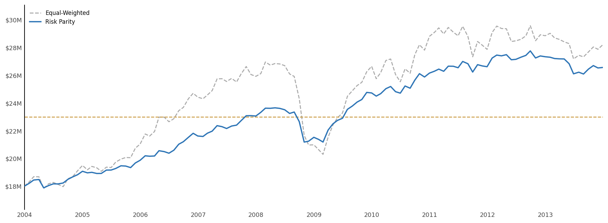
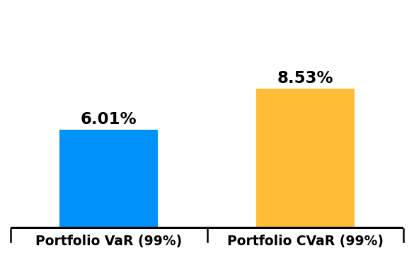
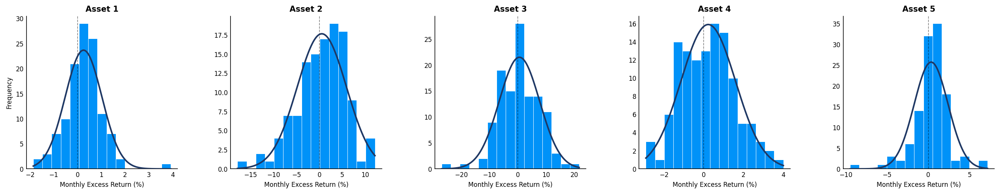

# Quantitative Portfolio Risk Methods

This project builds an Excel based portfolio construction and risk analysis model for a five asset strategic allocation problem. The analysis compares the existing equal weighted portfolio against mean variance optimization and inverse volatility risk parity under a historical simulation that includes the Global Financial Crisis period.

The workbook is the main model. It includes asset statistics, factor regressions, variance inflation checks, total risk contribution, constrained MVO, risk parity, and historical wealth simulations with spending assumptions.

## Objective

The client starts with 18 million USD and needs the portfolio to support a 23 million USD wealth target in five years while keeping drawdowns within a 15 percent risk tolerance. The analysis tests whether changing the allocation can improve downside protection and risk adjusted return during a stressed 2004 to 2013 simulation window.

## Methods

- Historical excess return analysis by asset
- Asset level VaR and CVaR
- Factor mapping across fixed income, equity, real assets, alternatives, inflation linked assets, and credit
- Regression based factor exposure estimation
- Variance inflation diagnostics for factor collinearity
- Historical simulation with monthly rebalancing, spending, and salary assumptions
- Constrained mean variance optimization
- Inverse volatility risk parity allocation
- Total risk contribution by asset and factor
- Portfolio comparison using drawdown, VaR, CVaR, Sharpe, Sortino, and Ulcer Performance Index

## Main Result

The final recommendation favors the inverse volatility risk parity portfolio. It gives up some return versus the current equal weighted portfolio, but materially improves the drawdown and tail risk profile.

| Portfolio | Annualized Return | Annualized Volatility | Max Drawdown | 99% VaR | 99% CVaR | Sharpe | Sortino | UPI |
| --- | ---: | ---: | ---: | ---: | ---: | ---: | ---: | ---: |
| Current Equal Weight | 4.59% | 8.40% | -24.69% | -5.89% | -8.43% | 0.53 | 0.79 | 0.52 |
| Mean Variance Optimization | 4.37% | 6.36% | -17.65% | -4.60% | -6.84% | 0.66 | 1.01 | 0.72 |
| Risk Parity 1 over Sigma | 3.67% | 3.96% | -8.60% | -3.05% | -4.00% | 0.89 | 1.51 | 1.15 |

Risk parity is the only tested allocation that keeps the historical max drawdown inside the 15 percent tolerance while improving Sharpe, Sortino, VaR, CVaR, and UPI.

## Final Allocation

| Asset | Current Weight | Risk Parity Weight | Change |
| --- | ---: | ---: | ---: |
| Asset 1 | 20.00% | 41.91% | 21.91% |
| Asset 2 | 20.00% | 7.18% | -12.82% |
| Asset 3 | 20.00% | 5.14% | -14.86% |
| Asset 4 | 20.00% | 24.10% | 4.10% |
| Asset 5 | 20.00% | 21.67% | 1.67% |

## Selected Charts







## Repository Structure

```text
model/
  quant_methods_portfolio_model.xlsx
figures/
  Exported risk and simulation charts
tables/
  portfolio_comparison.csv
  final_allocation.csv
scripts/
  extract_workbook_summary.py
DATA.md
requirements.txt
```

## Run the Workbook Audit

```bash
python3 -m venv .venv
source .venv/bin/activate
pip install -r requirements.txt
python scripts/extract_workbook_summary.py
```

The script prints a sheet level workbook audit and writes `tables/workbook_overview.csv`.


